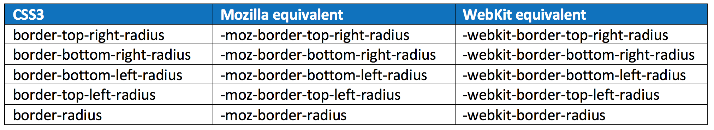
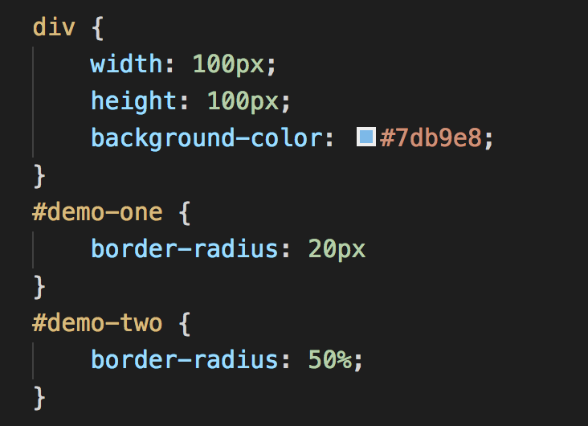
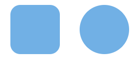

#Learn CSS Border-Radius Property By Building a Calculator

Have you ever seen a button on a web page that has rounded edges? Have you ever seen an image that fits within a circle? If so, you have seen the impact of using the CSS border-radius property.

You can give any element “rounded corners” by applying a border-radius through CSS.

##Border-radius syntax
As with many CSS properties relating to margins, padding and borders, there are four individual properties — one for each corner of a box element — and one shorthand property. Each of the corner attributes will accept one or two values.

The border-radius property is accepted in every major browser but they have browser specific attributes. Here are the CSS and brower-specific attributes:

Each of the individual corder CSS3 properties take either one or two length values (generally ‘px’ or ‘em’ values). If a single value is supplied then that becomes the radius of a rounded corner. If two values are supplied then they become the horizontal and vertical radii for an elliptical corner.

The border-radius property by itself accepts one or two values and uses them to style all four corners making a nice symmetric shape.

##Do you need to use border-prefixes anymore?

Now that I have shown you the browser-specific border prefixes, the question is do you really need to use them or can you get away with just using the CSS3 properties?

The simple answer to that question depends on what version of browsers your website supports. 

Firefox 3.6 requires the use of the -moz- prefix. From 4 up, using the CSS3 properties are fine.

Safari 4 needs -webkit- prefix. Safari 5 and above accept the CSS3 properties.

iOS3 needs -webkit- prefix. This applies only to an iPhone 3GS or iPad 1 that have never been upgraded.

##Basic Demonstration of border-radius property
Here are two demonstrations of the border radius. The value supplied for the property can be in px, rem, em or %.

For the first div a rounded corner of 8px is applied to every corner of the div. In the second example every corner has a rounded corner of 50% applied which creates a circle.

With just one value, border-radius will be the same on all four corners of an element as shown above. You do have the option of specifying a different value for each corner.

When you specify individual values then it is applied in this order: top left, top right, bottom right, bottom left. Here is an example:

##Elliptical Edges
The edges do not have to be circular, it can be elliptical. To create an elliptical edge you put a slash (“/”) between two values. Here is an example:

##Creating our calculator
We are going to apply what we have just learned about border-radius to create this calculator:

##Calculator Frame
First we need to create the frame for our calculator. The top of the calculator will have an arch and the bottom will have rounded edges. To create this design we will specify a value for each individual corner like this:

##Calculator result frame
The top of the calculator contains the total that has been calculated. It is comprised of two parts: the outer frame and the input area that contains the total. The outer frame uses the exact same border-radius of the frame to have the arch. Here is the styling for these two items:

##Calculator Logo and Power Button
The next items to add to our calculator is the logo “BLAND INSTRUMENTS” and the power button. We will use the code in #demo-four for the logo and the code in #demo-two for the power button. It looks like this:

##Calculator Buttons
Next we are going to create a styling for each calculator button. We are going to specify a style for each individual corner and we are going to provide two values for each corner. This produces a hand drawn look and feel for the buttons. Here is the code:

##Enter button
The last thing we need to add to our calculator is the ENTER button. We will be using the code from #demo-one for this button: Here is the code:

##Button Animation
The last thing we are going to add to our calculator is animation for the button when a user hovers over the button. This simulates the action of the button actually being pressed. 

To accomplish this we are going to add a box-shadow to our buttons. This is the shadow that will be shown for all buttons and gives the buttons the appearance to be slightly raised from the calculator frame.

To provide the animation we are going to add a transition to the button. Then we will supply a different box-shadow for the buttons when you hover over them. Here is the code:

And here is our finished calculator:
